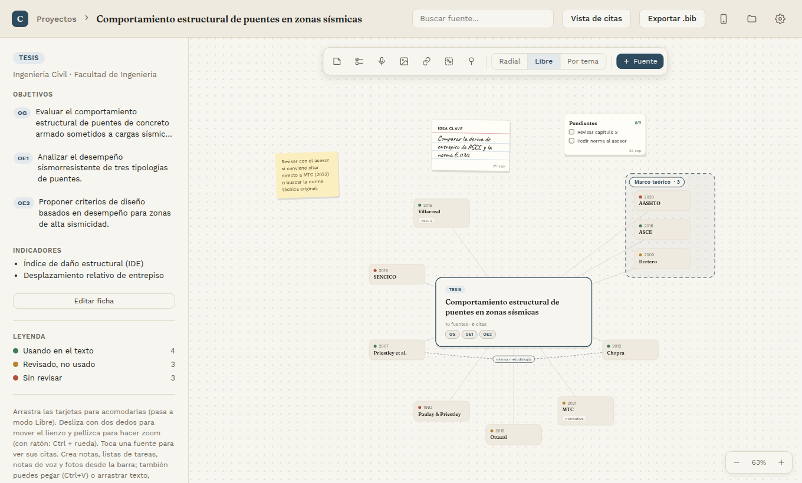
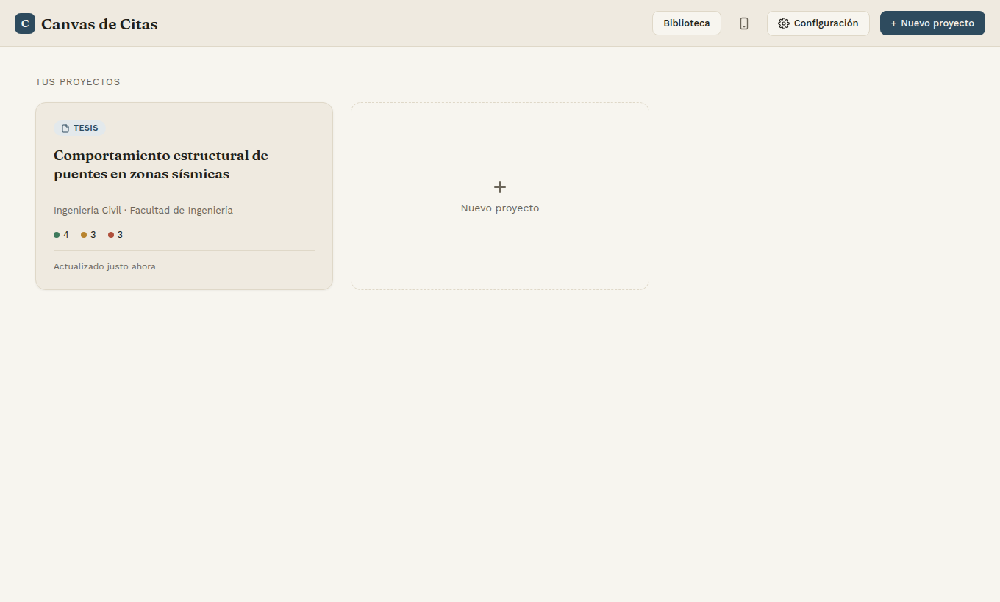
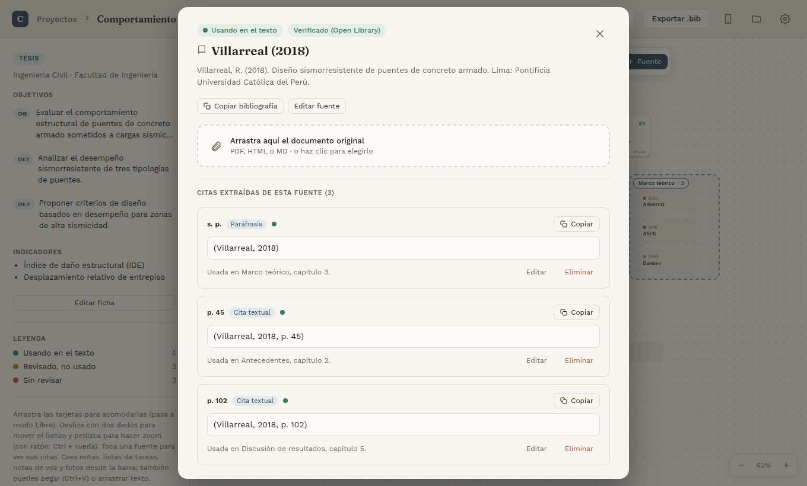
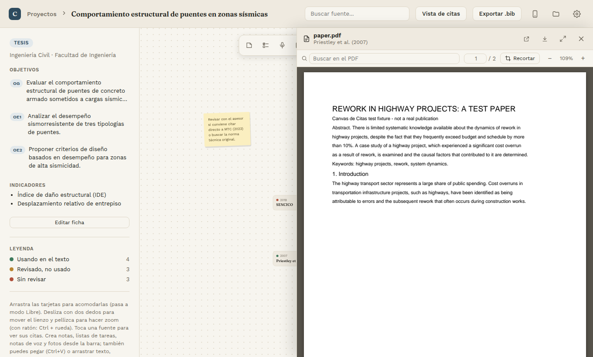
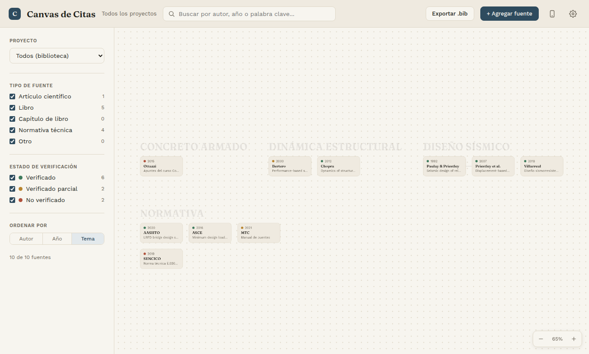
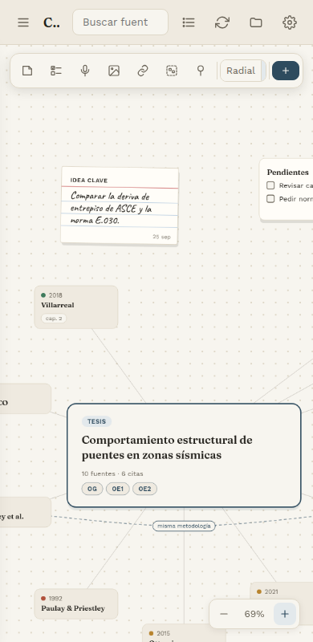
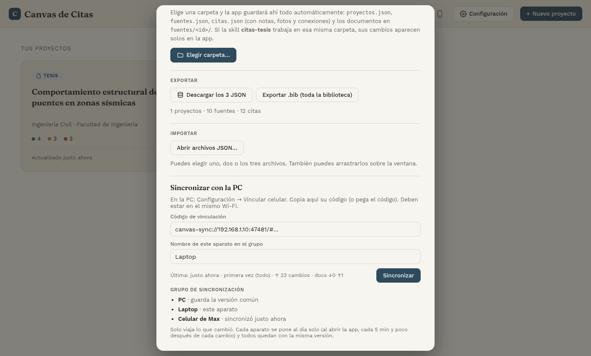

# Canvas de Citas

Tablero de investigación para la tesis: tus **fuentes**, sus **citas** y tus **ideas** en un
lienzo visual, con visor de PDF, biblioteca, app para el celular y conexión con Claude Code.

**Abrir la app:** https://1xmanmax.github.io/canvas-de-citas/ (funciona sin conexión y se puede
instalar como app desde el navegador).



---

## Qué puedes hacer

### 1. Proyectos
Cada tesis o trabajo es un proyecto. Los puntos de color dicen cuántas fuentes ya usas en el
texto (verde), revisaste pero no usas (ocre) o aún no revisas (rojo).



### 2. El lienzo
El proyecto va al centro y sus fuentes alrededor. En la barra de arriba:

| Botón | Para qué |
|---|---|
| Nota, Lista, Micrófono, Foto | Agregar notas adhesivas o fichas, listas de tareas, notas de voz (con transcripción) y fotos (con anotaciones y dibujo) |
| Enlace | Conectar dos elementos, con una etiqueta opcional |
| Recuadro punteado | **Agrupador**: reúne varios elementos bajo un nombre. Se ajusta solo a su contenido y, al arrastrar su nombre, se mueve todo junto. Suelta algo encima para agregarlo o arrástralo lejos para sacarlo |
| Chincheta | Tablero de corcho (hilos rojos y chinchetas) |
| Radial · Libre · Por tema | Cómo se acomodan las fuentes |

También puedes pegar (Ctrl+V) o arrastrar texto, imágenes y audios al lienzo. Cada **objetivo**
(OG, OE1…) tiene su propio lienzo: tócalo en la tarjeta del proyecto.

### 3. Fuentes y citas
Toca una fuente para ver su referencia, sus citas (textuales o paráfrasis, con página) y dónde
las usas. Copia la cita o la bibliografía con un clic y adjunta el documento original.



### 4. Visor de PDF
Lee el paper dentro de la app: búsqueda, zoom, **recortes** (tablas o figuras que van al lienzo
como foto) y **citas con vínculo**: cada nota creada desde el PDF vuelve a su lugar exacto en el
documento.



### 5. Biblioteca
Todas las fuentes de todos tus proyectos, con filtros por tipo y verificación, ordenadas por
autor, año o tema. Exporta la bibliografía a `.bib`.



### 6. En el celular y sincronizada
La app Android es la misma app. Tu PC guarda la versión común y cada aparato (celular, laptop…)
se sincroniza por el Wi-Fi de casa, **sin nube ni cuentas**:

- Solo viaja lo que cambió; si editaste en dos aparatos a la vez, todo se junta.
- Se sincroniza sola al abrir la app, cada 5 minutos y poco después de cada cambio.
- Todo viaja cifrado.

<p>
  
  &nbsp;
  
</p>

---

## Empezar

1. Abre la [app](https://1xmanmax.github.io/canvas-de-citas/). La primera vez puedes tocar
   **Cargar ejemplo** para ver cómo funciona.
2. **Configuración → Carpeta de almacenamiento** (Chrome, Edge o Comet en la PC): elige una
   carpeta y la app guardará ahí todo solo: `proyectos.json`, `fuentes.json`, `citas.json` y los
   documentos.
3. **Celular:** instala el APK (ver [android/README.md](android/README.md)) y, en
   Configuración → *Sincronizar con la PC*, escanea el QR o pega el código de vinculación.
4. **Laptop u otra PC:** abre la app, pega el mismo código en *Sincronizar con la PC* y ponle un
   nombre. Acepta el permiso de "red local" que pide el navegador.

## Con Claude Code

La carpeta de almacenamiento es la misma con la que trabajan las skills:

- **citas-tesis**: revisa y verifica citas según tu manual y en bases académicas (CrossRef,
  Semantic Scholar, OpenAlex…).
- **canvas-de-citas** ([claude-skill/](claude-skill/canvas-de-citas/)): Claude lee y edita tu
  lienzo: agrega fuentes, citas, notas, tareas o conexiones, busca en tus notas y audios.

La app escribe además un `CLAUDE.md` en esa carpeta con el resumen de todo (proyectos,
objetivos, fuentes, citas, notas, agrupadores). Los cambios de Claude aparecen solos en la app.

---

## Para desarrollar

| Carpeta | Qué hay |
|---|---|
| [`app/`](app/) | La app (Svelte 5 + Vite, sin librerías de UI) |
| [`android/`](android/) | App Android (Capacitor 8) que empaqueta `app/dist` |
| [`receptor/sincro/`](receptor/sincro/) | Servidor de sincronización (Rust) que corre en la PC |
| [`receptor/`](receptor/) | Receptor de Windows (pasar archivos con el celular / PixPin) |
| [`claude-skill/`](claude-skill/) | Skill de Claude Code |
| [`docs/`](docs/) | Diseños, planes y capturas |

```bash
cd app
npm ci
npm run dev               # desarrollo en http://localhost:5173
npm test                  # pruebas unitarias
npm run build             # versión para publicar (app/dist)
npm run test:e2e          # pruebas en el navegador (necesita Chrome)
npm run test:integracion  # app ↔ servidor de sincronización (necesita Rust)
node scripts/capturas-readme.mjs   # vuelve a generar las capturas de este README

cd ../android && npm ci && npm run apk     # APK para el celular (JDK 21 + Android SDK)
cd ../receptor/sincro && cargo test        # servidor de sincronización
```

La guía completa para trabajar en el repo (reglas, formato de datos, cómo publicar) está en
[CLAUDE.md](CLAUDE.md). El documento original de arranque del proyecto está en
[docs/handoff.md](docs/handoff.md).
